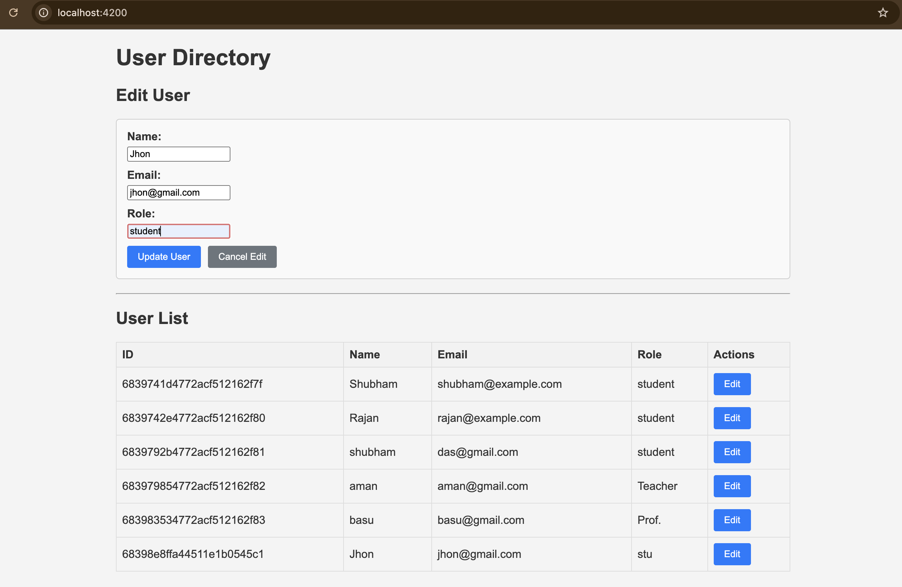

# Simple User Directory (GraphQL + Angular)

This project is a simple user directory application built with a Python (Flask) GraphQL backend and an Angular frontend.

## Tech Stack

- **Backend**: Python (Flask), Graphene (for GraphQL)
- **Frontend**: Angular (v15), Apollo Angular

## Project Structure

```
user-directory-assignment/
├── backend/
│   ├── app.py          # Flask application with GraphQL schema and resolvers
│   └── requirements.txt # Python dependencies
├── frontend/
│   └── user-interface/ # Angular project
│       ├── src/
│       │   ├── app/
│       │   │   ├── components/
│       │   │   │   └── user-list/  # User list component (display, create, edit)
│       │   │   ├── services/
│       │   │   │   └── graphql.service.ts # GraphQL interaction service
│       │   │   ├── app.component.html # Main app template
│       │   │   ├── app.module.ts    # Main app module with Apollo setup
│       │   │   └── ...
│       │   ├── styles.scss        # Global styles
│       │   └── ...
│       ├── angular.json
│       ├── package.json
│       └── ...
└── README.md
```

## Prerequisites

- Python 3.7+ and pip
- Node.js (v16+) and npm

## Running the Backend

1.  **Navigate to the backend directory:**
    ```bash
    cd backend
    ```

2.  **Create a virtual environment (recommended):**
    ```bash
    python3 -m venv venv
    source venv/bin/activate  # On Windows: venv\Scripts\activate
    ```

3.  **Install dependencies:**
    ```bash
    pip install -r requirements.txt
    ```

4.  **Run the Flask application:**
    ```bash
    python app.py
    ```
    The backend GraphQL server will be running at `http://localhost:5000/graphql`. You can access the GraphiQL interface in your browser to test queries.

## Running the Frontend

1.  **Navigate to the frontend Angular project directory:**
    ```bash
    cd frontend/user-interface
    ```

2.  **Install dependencies:**
    ```bash
    npm install
    ```

3.  **Run the Angular development server:**
    ```bash
    ng serve
    ```
    The frontend application will be running at `http://localhost:4200/`. Open this URL in your browser.

## Features

-   **Backend (GraphQL API):**
    -   `query getAllUsers`: Fetches all users.
    -   `mutation createUser(name, email, role)`: Adds a new user.
    -   `mutation updateUser(id, name, email, role)`: Updates an existing user by ID.
    -   In-memory data store.
-   **Frontend (Angular App):**
    -   Displays a list of users in a table.
    -   Allows creating a new user via a form.
    -   Allows editing an existing user (inline in the form).
    -   Communicates with the GraphQL backend using Apollo Angular.
    -   Basic form validations (required fields, email format).

## Screenshots

*(Please add screenshots of the running application here after setting it up.)*

**Example User List View:**
(Imagine a table listing users with ID, Name, Email, Role, and an Edit button)

**Example Create/Edit Form:**
(Imagine a form with fields for Name, Email, Role, and Add/Update/Cancel buttons)



